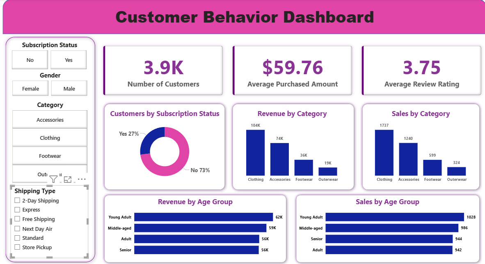

# 🛒 Customer Shopping Behavior Analysis

> **End-to-End Data Analytics Project \| Python • MySQL • SQL • Power
> BI**

## Project Overview

This project analyzes **3,900 customer shopping transactions** to
uncover purchasing behavior, customer segments, product performance, and
revenue trends. It demonstrates the complete analytics workflow from
data cleaning and feature engineering to SQL analysis and an interactive
Power BI dashboard.

## Tech Stack

-   Python (Pandas, NumPy)
-   MySQL
-   SQL (JOINs, CTEs, Window Functions, Views, CASE)
-   Power BI
-   Git & GitHub

## Project Workflow

Raw Data → Data Cleaning → Feature Engineering → MySQL → SQL Business
Analysis → Power BI Dashboard → Business Recommendations

## Dataset

-   3,900 Records
-   18 Features
-   Customer demographics
-   Purchase history
-   Subscription information
-   Shipping & discounts

## Business Questions

-   Revenue by customer demographics
-   Customer segmentation
-   Subscriber vs Non-subscriber analysis
-   Top-selling products
-   Discount effectiveness
-   Shipping comparison
-   Revenue by age group
-   Repeat purchase behavior

## Dashboard Features

-   Revenue KPIs
-   Sales KPIs
-   Customer Segmentation
-   Category Performance
-   Age Group Analysis
-   Dynamic Filters & Slicers

  

## Skills Demonstrated

-   Data Cleaning
-   Exploratory Data Analysis
-   Feature Engineering
-   Advanced SQL
-   Relational Database Design
-   Business Analytics
-   Dashboard Development
-   Data Visualization
-   KPI Reporting
-   Business Storytelling

## Business Value

This project showcases an end-to-end analytics pipeline used in
real-world business environments, transforming raw transactional data
into actionable insights and interactive dashboards to support
data-driven decision-making.
